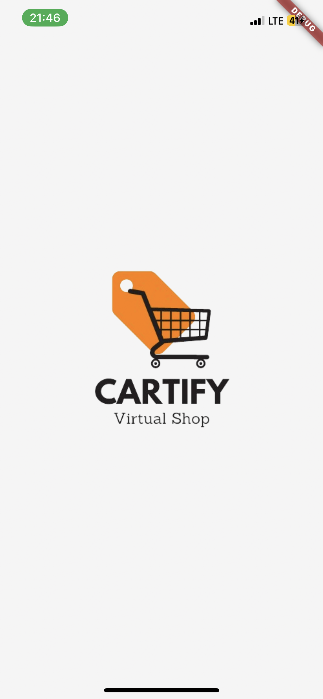
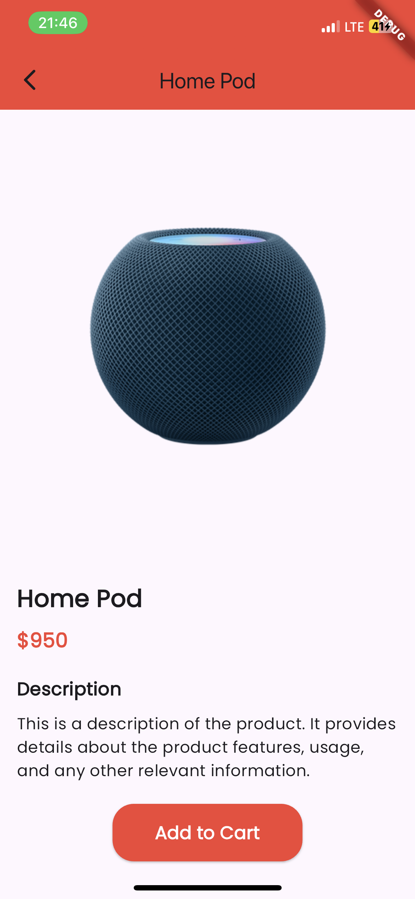
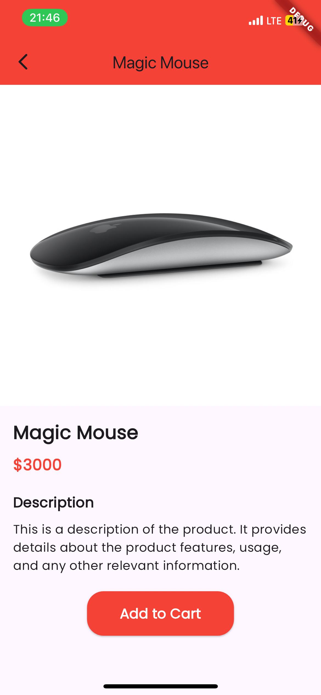
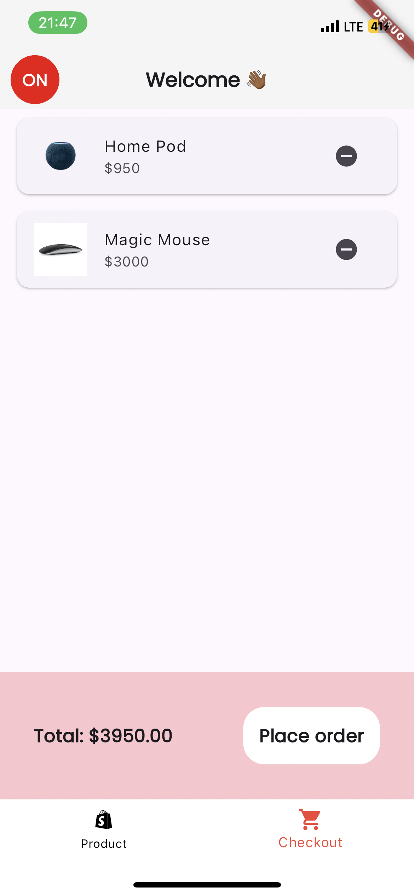
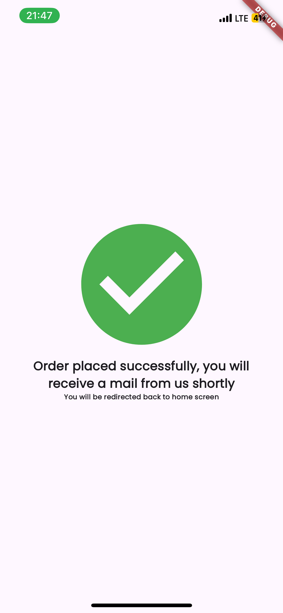

# CARTIFY

Welcome to the **CARTIFY**! This is a simple e-commerce app built with Flutter. The app does not rely on any external dependencies for state management; instead, it uses `setState` to manage the items in the cart and data across different screens.

## Features

- Browse products
- Add items to cart
- View cart
- Remove items from cart
- Checkout process

## Screenshots








## Download

You can download the app from the link below:

[Download CARTIFY here](https://www.mediafire.com/file/q7f1jx70zdtp8wv/cartify.apk/file)

## Getting Started

To clone and run this application, you'll need [Git](https://git-scm.com) and [Flutter](https://flutter.dev/docs/get-started/install) installed on your computer. From your command line:

```bash
# Clone this repository
$ git clone https://github.com/nannoy/cartify.git

# Go into the repository
$ cd YOUR_REPOSITORY_NAME

# Install dependencies
$ flutter pub get

# Run the app
$ flutter run
